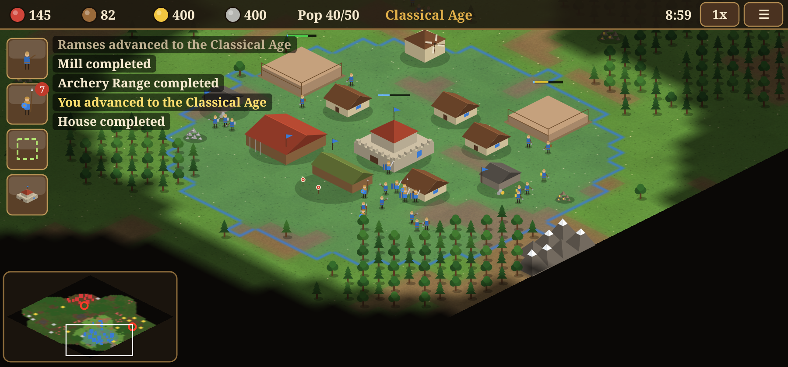
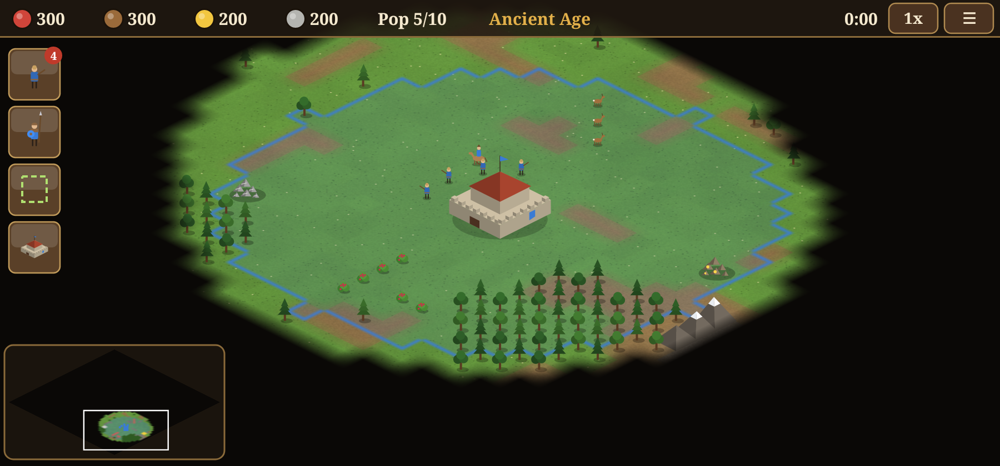
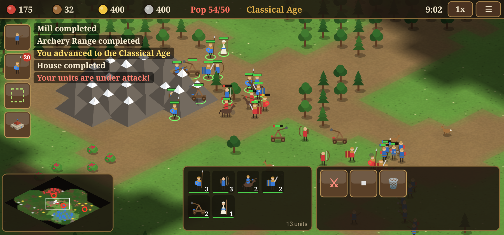
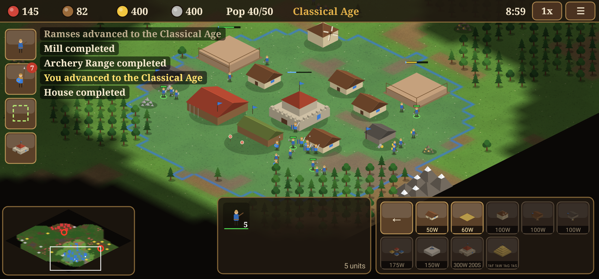
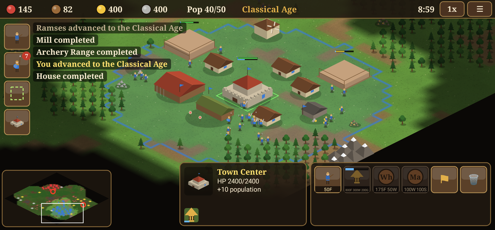
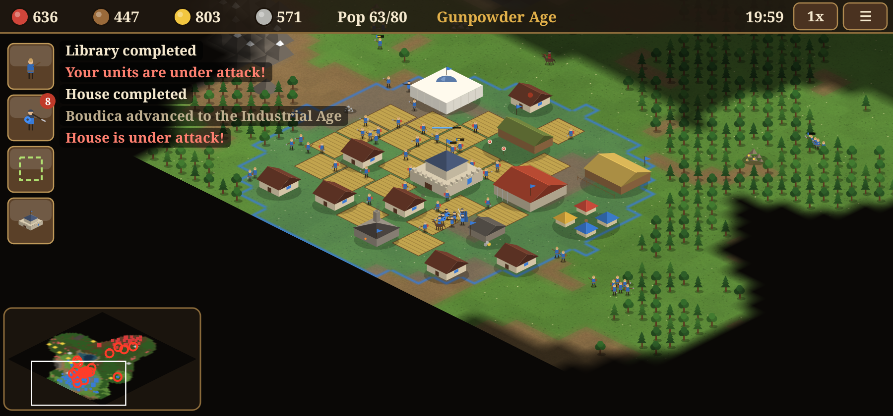
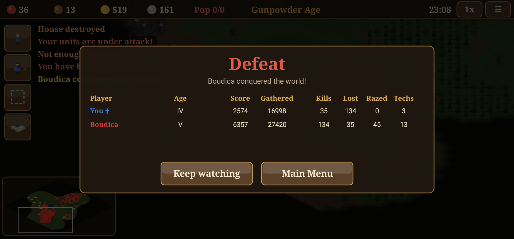

# Rise to Power

Rise to Power is a real-time strategy game for Android, in the tradition of *Rise of Nations* and *Age of Empires*.
You gather resources and build an economy, then move through five ages and claim territory. You win by conquering your rivals or by building a Wonder.

It is written in Kotlin with no game engine and no art assets. The isometric graphics are drawn procedurally on a hardware-accelerated `SurfaceView`, and the sound effects are synthesized at runtime.



## Download

Every merge to `main` is tested, built and published as an APK on the
[Releases page](https://github.com/nsheaps/rise-to-power/releases). To install it, download the APK on an Android 8.0+ device
and allow installs from that source.

## Feature overview

| Area | What's included |
|---|---|
| Ages | Ancient → Classical → Medieval → Gunpowder → Industrial. Units upgrade automatically each age (Bowman → Archer → Crossbowman → Arquebusier → Rifleman) |
| Resources | Food (berries, hunting, farms), wood, gold, stone. There are drop-off camps, carry limits and a market with dynamic prices |
| Civilizations | Romans, Greeks, Egyptians, Mongols, Chinese, Britons, each with a unique bonus |
| Units | Citizen, Scout, Spearman, Warrior, Archer, Horseman, Horse Archer, Catapult, Healer. They have armor classes and counter bonuses (spears beat cavalry, archers beat infantry, siege beats buildings) |
| Buildings | 18 types: Town Center, House, Farm, Mill, Lumber/Mining Camp, Barracks, Archery Range, Stable, Blacksmith, Library, Siege Workshop, Temple, Market, Tower, Wall, Fortress, Wonder |
| Technologies | About 30 economic, military and civic techs with prerequisites |
| Territory | National borders grow from Town Centers, Towers and Fortresses. You can only build inside your borders, and enemies take attrition there |
| Map | 4 map types (Continental, Highlands, Great Lakes, Black Forest) and 3 sizes, with 2–8 players. Elevation, water, mountains and fog of war |
| AI | Opponents run a full economy and build order, advance through the ages, expand, trade, defend and attack in waves. There are 4 difficulty levels |
| Victory | Conquest, or a Wonder that stands for 5 minutes. The end screen shows statistics |
| Game options | Teams (free-for-all, you against all, or you with an ally), starting resources, Wonder victory on/off, revealed map, game speed 1×/2×/3×, pause |
| Persistence | Save & quit, plus an autosave when the app goes to the background |

## Screenshots

| | |
|---|---|
|  |  |
|  |  |
|  |  |

The screenshots are rendered by `ScreenshotTest`, which runs the real game view through Robolectric's native graphics.

## Controls

| Gesture | Action |
|---|---|
| Tap unit / building | Select (double-tap selects all of that type on screen) |
| Tap ground / target | Smart command: move, gather, build/repair, attack or heal |
| Drag | Pan the camera |
| Pinch | Zoom |
| Long-press, then drag | Box-select units |
| Box button | Toggle box-select mode for one drag |
| Minimap | Tap or drag to jump the camera |
| Idle / Army buttons | Select an idle citizen, or the whole army |
| Long-press a HUD button | Show its tooltip (cost, stats, description) |
| Back | Cancel the current mode, or open the pause menu |

To place a building, pick it from a citizen's build menu, tap to position it and tap again to confirm. Walls take two taps, one for each end of the line.

## Project layout

```
core/   Pure Kotlin simulation (no Android dependencies): map generation, pathfinding,
        combat, economy, territory, AI, save format. Unit-tested headlessly.
app/    Android UI: menu, game view, renderer, HUD, input, sound.
```

## Building

You need JDK 17+ and the Android SDK (platform 35). Point to the SDK with `local.properties` or `ANDROID_HOME`.

```sh
./gradlew :core:test              # simulation tests, including full AI-vs-AI games
./gradlew :app:testDebugUnitTest  # Robolectric UI smoke test + screenshots
./gradlew assembleDebug           # APK in app/build/outputs/apk/debug/
```

The app requires Android 8.0 (API 26) or newer.

## Releases and versioning

The [Build workflow](.github/workflows/build.yml) runs the tests and builds the APKs on every pull request and push.
On pushes to `main` it also tags the commit and publishes a GitHub release with the APK attached.

Versions follow [semantic versioning](https://semver.org) and are computed from the commits since the last `vX.Y.Z` tag.
The game is in pre-release (`0.x`) until it is confirmed working on devices, and 0.x builds are published as GitHub pre-releases.

| Commit message | While 0.x | From 1.0.0 |
|---|---|---|
| `BREAKING CHANGE` in the body, or `type!:` prefix | minor | major |
| `feat:` / `feat(scope):` | minor | minor |
| anything else | patch | patch |
| `Release-As: X.Y.Z` line in the body | sets the version | sets the version |

The first release is `0.1.0`. The only way to reach `1.0.0` is a commit with `Release-As: 1.0.0`.

`versionCode` is the commit count on `main`, so it always increases. For a local build, pass
`-PversionName=… -PversionCode=…`, or leave them out to get `0.0.0-dev`.

### Signing

By default, release APKs are signed with the runner's throwaway debug key. Each release then has a different signature, so you have to
uninstall one release before installing the next. To sign every release with a stable key and get in-place upgrades, add these repository secrets:

| Secret | Value |
|---|---|
| `RELEASE_KEYSTORE_BASE64` | `base64 -w0 release.jks` |
| `RELEASE_KEYSTORE_PASSWORD` | keystore password |
| `RELEASE_KEY_ALIAS` | key alias |
| `RELEASE_KEY_PASSWORD` | key password |
